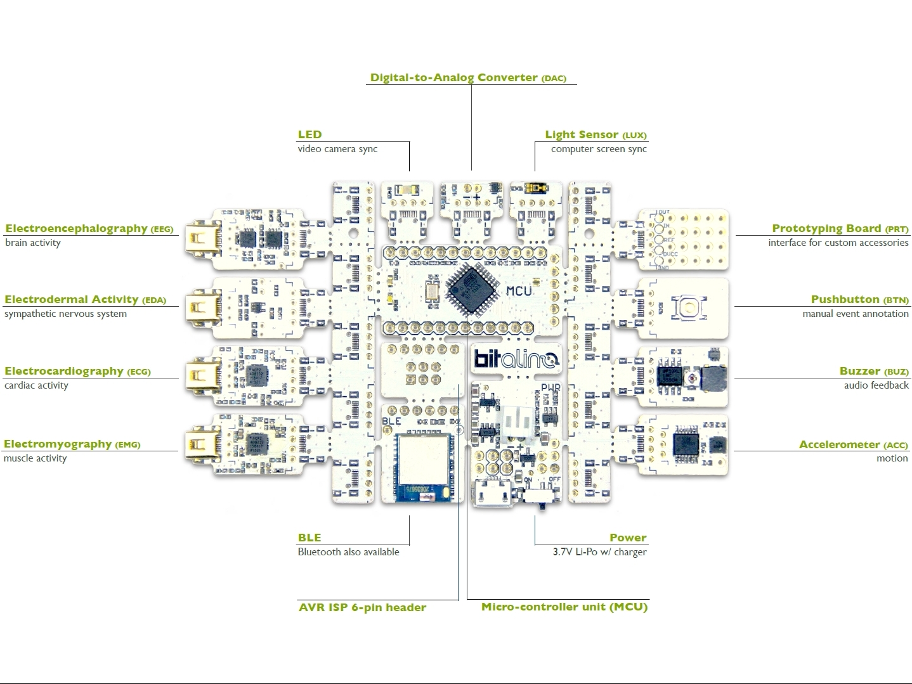
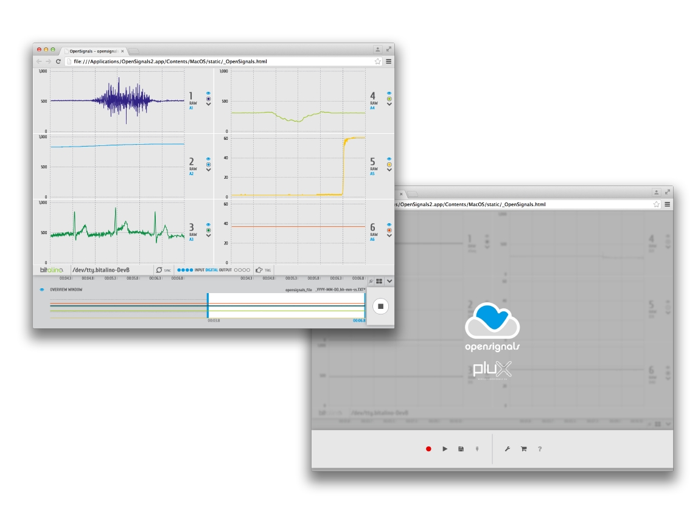

*Bitalino python lab guide based on a presentation created by Hugo Silva. 
Adapted by Miquel Alfaras and Hugo Gamboa.*

* [0 Setting up](#settingup)
* [1 Acquisition](#acq)
* [2 Open a signal in python](#opensignal)
* [3 Process a signal](#process)
* [4 Measure and actuate with BITalino](#measure)
* [5 Online processing of signals](#online)
* [6 Live on the Webbrowser](#browser)
* [7 External links](#external)


##  0 Setting up <a name="settingup"></a>
- Install the Anaconda Python distribution that best suits your platform:  
 https://www.anaconda.com/download/

- Install BITalino's serverBIT (r)evolution:    
https://github.com/BITalinoWorld/revolution-python-serverbit

- Install openSignals (r)evolution Software:  
http://bitalino.com/en/software

- Get a good code editor:  

    - **Spyder** is already included with Anaconda *or*

    - **Pycharm** https://www.jetbrains.com/pycharm/  

- Enjoy executing some code:  
Launch a jupyter notebook


- Architecture of **bitalino** 
[BITalino datasheet](http://bitalino.com/datasheets/REVOLUTION_BITalino_Board_Kit_Datasheet.pdf).




## 1 Acquisition <a name="acq"></a>

Once your BITalino is turned on, make sure the device is paired by the Bluetooth connection that you will use to receive the data.  You will match your device given the MAC address that is written in the back label. 

Default PIN is **1234**.

- Open **OpenSignals** and proceed to configure your acquisition (sensors, channels, type of data, sampling rate). 

- Test sensor acquisition. It is important that you check sensor Datasheets to find out about the correct electrode placement, specs and formulas used for transfer functions:
    1. [How to acquire EMG](http://bitalino.com/datasheets/REVOLUTION_EMG_Sensor_Datasheet.pdf) 

    2. [How to acquire EDA](http://bitalino.com/datasheets/REVOLUTION_EDA_Sensor_Datasheet.pdf) 


    3. [How to acquire ECG](http://bitalino.com/datasheets/REVOLUTION_ECG_Sensor_Datasheet.pdf) 


    4. [How to acquire EEG](http://bitalino.com/datasheets/EEG_Sensor_Datasheet.pdf) 


    5. [How to acquire ACC](http://bitalino.com/datasheets/REVOLUTION_ACC_Sensor_Datasheet.pdf) 


    6. [How to acquire LUX](http://bitalino.com/datasheets/LUX_Sensor_Datasheet.pdf) 


    7. [How to acquire BTN](http://bitalino.com/datasheets/BTN_Sensor_Datasheet.pdf) 

- **Record a signal**



## 2 Open a signal in python <a name="opensignal"></a>

Proceed to opening a signal data file sample [SampleEMG.txt](SampleEMG.txt).

You can use python script [LoadFile.py](LoadFile.py):
```
from pylab import *

data = loadtxt("SampleEMG.txt")

plot(data[:,5])
show()
```

Use this code in spyder or in a Jupyter notebook

## 3 Process a signal <a name="process"></a>

Based on the previous code process the EMG signal to compute the envelope of the EMG (smooth the abs of the signal after removing the mean)

You can use python script [ProcessFile.py](ProcessFile.py):
```
from pylab import *
from numpy import *
from scipy import signal

def lowpass(s, f, order=2, fs=1000.0):
    b, a = signal.butter(order, f / (fs/2))
    return signal.lfilter(b, a, s)

data = loadtxt("SampleEMG.txt")[:,5]

abs_data = abs(data-mean(data))

proc_data = lowpass(abs_data, 10) #Filter with a lowpass filter at 10Hz

plot(data)

plot(proc_data)

show()
```


## 4 Measure and actuate with BITalino (asynchronous) <a name="measure"></a>

[LightsBIT.py](LightsBIT.py)
```
import bitalino

import numpy

# Mac OS
macAddress = "/dev/tty.BITalino-01-93-DevB"

# Windows
# macAddress = "XX:XX:XX:XX:XX:XX"
 
device = bitalino.BITalino(macAddress)

state = device.state()

toggle = 1-state['digitalChannels'][2]

device.trigger([toggle, 0])

device.battery(0 if toggle else 63)

print "LIGHTS ON" if toggle else "LIGHTS OFF"

device.close()
```

```
import bitalino

import numpy

# Mac OS
macAddress = "/dev/tty.BITalino-01-93-DevB"

# Windows
# macAddress = "XX:XX:XX:XX:XX:XX"
 
device = bitalino.BITalino(macAddress)

while True:
    state = device.state()
    
    toggle = state['digitalChannels'][0]
    
    device.trigger([toggle, 0])
    
    device.battery(0 if toggle else 63)
    
    print "LIGHTS ON" if toggle else "LIGHTS OFF"

device.close()

```


[ButtonBIT.py](ButtonBIT.py)

[](https://www.youtube.com/watch?v=LOFUTNEgrv4)

## 5 Online processing of signals <a name="online"></a>
MuscleBIT.py 
```
import bitalino

import numpy
import time

# Mac OS
macAddress = "/dev/tty.BITalino-01-93-DevB"

# Windows
# macAddress = "XX:XX:XX:XX:XX:XX"
   
device = bitalino.BITalino(macAddress)
time.sleep(1)

srate = 1000
nframes = 100
threshold = 5

device.start(srate, [0])
print "START"

try:
    while True:

        data = device.read(nframes)
        
        if numpy.mean(data[:, 1]) < 1: break

        EMG = data[:, -1]
        
        envelope = numpy.mean(abs(numpy.diff(EMG)))

        if envelope > threshold:
            device.trigger([0, 1])
        else:
            device.trigger([0, 0])

finally:
    print "STOP"
    device.stop()
    device.close()
```


## 6 Live on the Webbrowser <a name="browser"></a>
Demo of serverbit + webrowser

BITalino revolution ServerBIT is a utility that helps you stream your signals in real time on a webbrowser (ClientBIT.html)
https://github.com/BITalinoWorld/revolution-python-serverbit

Once installed, run BITalino ServerBIT and open your ClientBIT.html. MAC address and channels can be configured through the **config.json** that is created under your home user folder. 

Open ClienBIT.html with a browser and watch your signals in real time. Graphics are processed by **FLOT**. Feel free to source the web and inspect the codes to get the best data presentation features.
http://www.flotcharts.org/flot/examples/basic-options/index.html


## 7 External links <a name="external"></a>
BITalino Forum http://forum.bitalino.com/

BITalino APIs http://bitalino.com/en/development/apis

BITalino python API documentation http://bitalino.com/pyAPI/
...

## Installation Notes 


### On Windows (for Python 3)

1. Install Anaconda3-4.2.0 (most recent with Python 3.5) according to your system 
https://repo.continuum.io/archive/

2. Install dependencies
```
pip install pyserial
```

3. Download and install old PyBluez (3.5) package wheel for the user platform (e.g. WinX64), not available from PyBluez pypi resources
https://www.lfd.uci.edu/~gohlke/pythonlibs/#pybluez
PyBluez‑0.22‑cp35‑none‑win_amd64.whl
```
pip install PyBluez-0.22-cp35-none-win_amd64.whl
```

4. Create a folder called  revolution-python-api

5. Download af12066 BITalino patch .zip and extract py files into the created folder called revolution-python-api

https://github.com/BITalinoWorld/revolution-python-api/archive/master.zip

6. Test bitalino.py (e.g. with a jupyter notebook test file) 

Should see data collected by bitalino printed on the console

### On Windows (for Python 2)

1. Install Anaconda 2.7 version 
https://repo.continuum.io/archive/

2. Install dependencies
```
pip install pyserial
```
3. Download and install old PyBluez (2.7) package wheel for the user platform (e.g. WinX64), not available from PyBluez pypi resources
https://www.lfd.uci.edu/~gohlke/pythonlibs/#pybluez
PyBluez‑0.22‑cp27‑none‑win_amd64.whl
```
pip install PyBluez-0.22-cp27-none-win_amd64.whl
```


4. Install bitalino API

```
pip install bitalino
```

5. Test LightsBIT.py (e.g. with a jupyter notebook test file) 

Should see the led turning on or off


### On Macos

1. Install Anaconda2.7 
https://repo.continuum.io/archive/

2. Install pyserial dependency
```
conda install -c conda-forge pyserial
```
3. Install bitalino API

```
pip install bitalino
```

4. Test LightsBIT.py (e.g. with a jupyter notebook test file) 

Should see the led turning on or off


